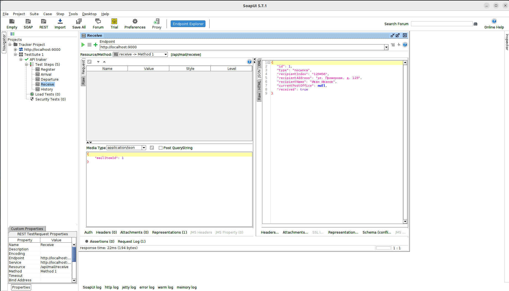

### 1. Регистрация почтового отправления

Метод регистрирует новое почтовое отправление и сохраняет его в системе.

**Параметры запроса:**

- `mailItem` (тип: JSON) - объект, содержащий информацию о почтовом отправлении.

**Возвращаемое значение:**

- `MailItem` - объект, представляющий зарегистрированное почтовое отправление.

**Действия метода:**

1. Регистрирует почтовое отправление с использованием переданных данных.
2. Создает запись о регистрации в истории перемещений.

**Возможные ошибки:**

- 400 Bad Request: Если данные в запросе не соответствуют требованиям валидации,
  будет возвращена ошибка с соответствующим сообщением.
- 500 Internal Server Error: В случае внутренней ошибки сервера, такой как
  недоступность базы данных или другие проблемы, будет возвращена ошибка с сообщением об
  ошибке.

### 2. Обновление прибытия почтового отправления

Метод обновляет информацию о прибытии почтового отправления в указанное почтовое отделение.

**Параметры запроса:**

- `request` (тип: JSON) - объект, содержащий информацию о запросе на обновление прибытия.
- `mailItemId` (тип: Long) - идентификатор почтового отправления.
- `postOfficeId` (тип: Long) - идентификатор почтового отделения.

**Возвращаемое значение:**

- `MailItem` - объект, представляющий обновленное почтовое отправление.

**Действия метода:**

1. Получает идентификатор почтового отправления и почтового отделения из запроса.
2. Обновляет информацию о текущем местонахождении почтового отправления.
3. Создает запись о прибытии в истории перемещений.

**Возможные ошибки:**

- 400 Bad Request: Если данные в запросе не соответствуют требованиям валидации,
  будет возвращена ошибка с соответствующим сообщением.
- 404 Not Found: Если указанный идентификатор почтового отправления или почтового отделения не существует,
  будет возвращена ошибка с сообщением о том, что ресурс не найден.
- 500 Internal Server Error: В случае внутренней ошибки сервера, такой как недоступность базы данных или другие
  проблемы, будет возвращена ошибка с сообщением об ошибке.

### 3. Обновление убытия почтового отправления из почтового отделения

Метод обновляет информацию об убытии почтового отправления из указанного почтового отделения.

**Параметры запроса:**

- `request` (тип: JSON) - объект, содержащий информацию о запросе на обновление убытия.
- `mailItemId` (тип: Long) - идентификатор почтового отправления.

**Возвращаемое значение:**

- `MailItem` - объект, представляющий обновленное почтовое отправление.

**Действия метода:**

1. Получает идентификатор почтового отправления из запроса.
2. Обновляет информацию о текущем местонахождении и статусе почтового отправления.
3. Создает запись об убытии из отделения в истории перемещений.

**Возможные ошибки:**

- 400 Bad Request: Если данные в запросе не соответствуют требованиям валидации,
  будет возвращена ошибка с соответствующим сообщением.
- 404 Not Found: Если указанный идентификатор почтового отправления или почтового отделения не существует,
  будет возвращена ошибка с сообщением о том, что ресурс не найден.
- 500 Internal Server Error: В случае внутренней ошибки сервера, такой как недоступность базы данных или другие
  проблемы, будет возвращена ошибка с сообщением об ошибке.

### 4. Прием почтового отправления адресатом

Метод обновляет статус почтового отправления, указывая, что оно было успешно получено адресатом.

**Параметры запроса:**

- `wrapper` (тип: JSON) - объект-обертка, содержащий идентификатор почтового отправления.
- `mailItemId` (тип: Long) - идентификатор почтового отправления.

**Возвращаемое значение:**

- `MailItem` - объект, представляющий обновленное почтовое отправление с новым статусом "Доставлено адресату".

**Действия метода:**

1. Получает идентификатор почтового отправления из запроса.
2. Обновляет статус почтового отправления на "Доставлено адресату".
3. Создает запись о доставке в истории перемещений.

**Возможные ошибки:**

- 400 Bad Request: Если данные в запросе не соответствуют требованиям валидации или почтовое отправление уже имеет
  статус "Доставлено адресату",
  будет возвращена ошибка с соответствующим сообщением.
- 404 Not Found: Если указанный идентификатор почтового отправления не существует, будет возвращена ошибка
  с сообщением о том, что ресурс не найден.
- 500 Internal Server Error: В случае внутренней ошибки сервера, такой как недоступность базы данных или другие
  проблемы, будет возвращена ошибка с сообщением об ошибке.

### 5. Получение полной истории перемещений почтового отправления

Метод возвращает полную историю перемещений для указанного почтового отправления.

**Параметры запроса:**

- `request` (тип: JSON) - объект, содержащий идентификатор почтового отправления.
- `mailItemId` (тип: Long) - идентификатор почтового отправления, для которого требуется получить историю перемещений.

**Возвращаемое значение:**

- Список объектов `MovementHistory`, представляющих историю перемещений почтового элемента.

**Действия метода:**

1. Получает идентификатор почтового отправления из запроса.
2. Проверяет наличие почтового отправления с указанным идентификатором.
3. Возвращает список записей о перемещениях почтового отправления, если они доступны.
4. Ведет логирование информации о найденной истории перемещений.

**Возможные ошибки:**

- 400 Bad Request: Если почтовый элемент не найден или история перемещений пуста, будет возвращена ошибка
  с соответствующим сообщением.
- 500 Internal Server Error: В случае внутренней ошибки сервера, такой как недоступность базы данных или другие
  проблемы, будет возвращена ошибка с сообщением об ошибке.

